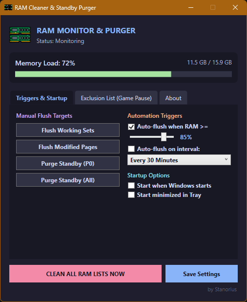
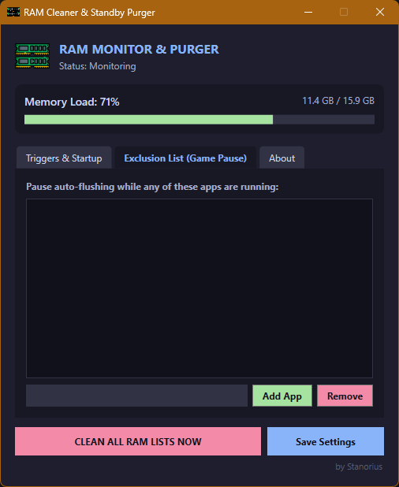
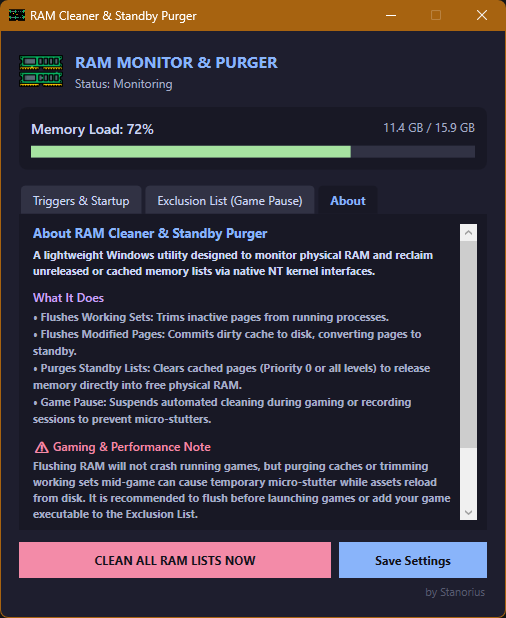

# RAM Cleaner & Standby Purger

A lightweight, dark-themed Windows utility designed to monitor physical RAM and instantly reclaim unreleased working sets and cached standby lists via native NT kernel interfaces.

---

  

<b>📸 View More Screenshots (Game Pause Exclusion List & Architecture)</b>

 

  
  

## ✨ Features

* **⚡ Native NT Kernel Purging:** Direct invocation of `NtSetSystemInformation` with elevated token privileges to flush memory caches instantly.
* **📊 Real-time Memory Meter:** Live physical RAM gauge tracking exact load percentage and utilized/total capacity.
* **🎯 Granular Flush Controls:**
  * **Working Sets:** Trims idle memory pages across user-mode processes.
  * **Modified Page List:** Forces dirty cache writeback to disk.
  * **Standby List (Priority 0):** Evicts only low-priority cached memory.
  * **Standby List (All):** Fully purges the standby cache for maximum free RAM.
* **⏱️ Automation Triggers:** Configurable threshold (e.g., auto-flush when RAM ≥ 85%) and interval timer flushes (15m, 30m, 1h, 2h).
* **🎮 Game Pause / Exclusion List:** Suspends scheduled and threshold cleanups when user-defined games or heavy applications are running to avoid mid-session micro-stutters.
* **🪟 Low Overhead Tray Service:** Minimizes to the taskbar tray with quick context-menu flush actions.

---

## 🚀 Download & Installation

1. Download **`RamCleaner-v1.0.0-win-x64.zip`** from the **[Releases](https://github.com/ghostrager1990/RAM-Cleaner-Standby-Purger/releases)** section.
2. Extract the archive anywhere on your system.
3. Launch `RamCleaner.exe` (Run as Administrator is requested automatically via manifest for kernel memory privileges).

---

## ⚠️ Performance Note for Gamers

Flushing RAM does **not** crash active games. However, clearing caches mid-game may introduce brief frame hitching or micro-stutters while evicted textures reload from storage. 

**Recommended Practice:**
1. Run **Clean All RAM Lists Now** prior to launching your game session.
2. Add your game executable (e.g., `game.exe`) into the **Exclusion List (Game Pause)** tab.

---

## 📄 License & Credits

* Licensed under the **[MIT License](LICENSE)**.
* **H.NotifyIcon.Wpf:** Copyright © HavenDV (MIT License).
* Developed by **Stanorius**.
